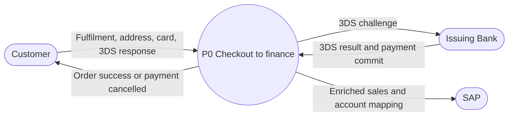
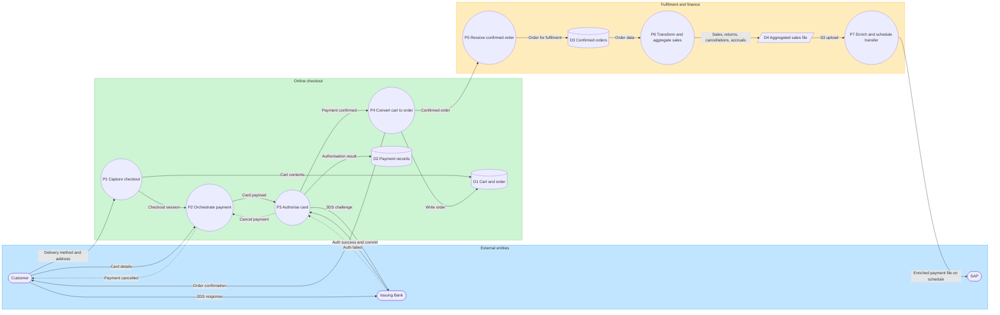

# Credit card checkout to SAP — data flow diagram

**Status: draft.** This is a data-flow view of a supplied swimlane process diagram. It is not approved knowledge until merged to `main` and reviewed by process and system owners.

It describes **what data moves between systems**, not every UI click. Process names and stores below are taken from the source diagram and aligned to known Cart assets where those names already exist (`Paydock`, `CommerceTools`, `OMFP`, `Order Master`).

## Notation

| Symbol | Meaning |
|---|---|
| Stadium | External entity (person or system outside the process boundary) |
| Circle | Process that transforms data |
| Cylinder | Data store |
| Document | File or batch artefact |
| Solid arrow | Data flow (labelled with the payload) |
| Dotted arrow | Async, scheduled, or exception flow |

## Level 0 — context

The checkout-to-finance process sits between the customer, the issuing bank, and SAP.

## Level 1 — data flows

## Process dictionary

| ID | Process | System | Data in | Data out |
|---|---|---|---|---|
| P1 | Capture checkout | Cart UI / CommerceTools | Fulfilment method, delivery address, cart | Checkout session, cart snapshot |
| P2 | Orchestrate payment | Paydock | Invoke CC method, card details, cancel events | Hosted CC capture, payment cancelled message |
| P3 | Authorise card | MPGS and issuing bank | Card payload, 3DS response | Authorisation result, commit or cancel |
| P4 | Convert cart to order | CommerceTools | Payment confirmed, cart | Order record, customer success message, confirmed order to DOM/OMFP |
| P5 | Receive confirmed order | DOM / OMFP | Confirmed order | Fulfilment order store |
| P6 | Transform and aggregate sales | Order Master | Order id, account, product, transaction price (ECB or local) | Aggregated sales file covering invoiced, processed, returned, cancelled, accruals |
| P7 | Enrich and schedule transfer | B2B | Sales file | Account-enriched payment file transferred on schedule to SAP |

## Data stores and artefacts

| ID | Store / artefact | Held by | Contents |
|---|---|---|---|
| D1 | Cart and order | CommerceTools | Cart, converted order |
| D2 | Payment records | Paydock / MPGS | Card authorisation, commit, cancel |
| D3 | Confirmed orders | DOM / OMFP | Fulfilment-ready order |
| D4 | Aggregated sales file | Object storage (S3 upload) | CSV/doc of aggregated sales data |

SAP receives transactions and account mapping and updates accounting entries. That ledger sits inside SAP, outside this process boundary.

## Control notes from the source diagram

- Customer success is shown when CommerceTools converts cart to order. DOM/OMFP confirmation is **async** and is not required before the success message.
- 3DS failure cancels payment in MPGS and Paydock and shows a cancelled message to the customer.
- B2B transfer to SAP is **scheduled** (batch), not real-time checkout.

## Assumptions and open questions

These items are inferred from the diagram or named in Cart knowledge; they are not independently verified here.

1. CT in the source diagram is treated as CommerceTools.
2. DOM/OMFP is treated as the AU fulfilment handoff (`OMFP Order Transfer` in Cart systems). NZ DOM transfer is not shown in the source diagram.
3. Whether Order Master reads from DOM/OMFP, CommerceTools, or both is not specified beyond “receive order data”.
4. File format is shown as CSV in some labels and “doc” in others; treat the artefact as an aggregated sales file until the B2B contract is confirmed.
5. Sale returned / cancelled / accruals paths are transformations inside P6; they are not expanded as separate checkout journeys.

## Related knowledge

- `knowledge/systems/checkout-systems.md` — Paydock, CommerceTools, OMFP Order Transfer, Order Master
- `knowledge/domains/checkout-domains.md` — credit/debit card payment recorded on Paydock
